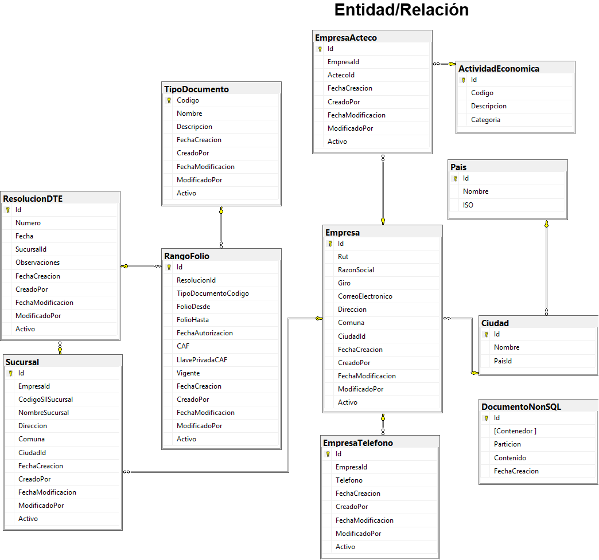
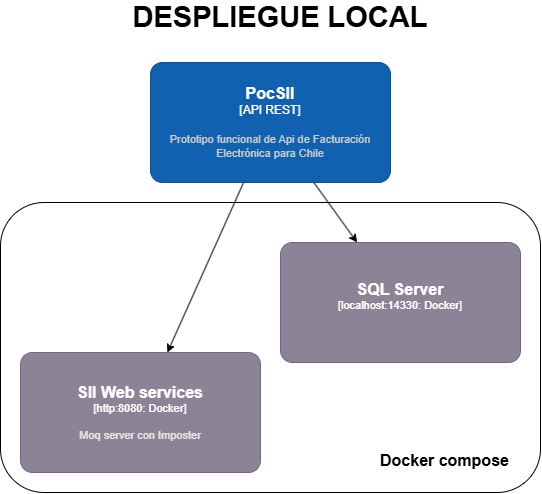

# PocSII - Prototipo de API de Facturación Electrónica para Chile

## Objetivo Principal

Desarrollar un prototipo funcional (Proof of Concept, POC) de una API moderna para la emisión de Documentos Tributarios Electrónicos (DTE) en Chile, específicamente una factura tipo 33 básica.

---

## Objetivos Clave

- Crear endpoints REST para:
  - Emitir un DTE
  - Consultar el estado de envío por folio
- Manejar firma digital y folios (CAF)
- Simular el envío de documentos al Servicio de Impuestos Internos (SII)
- Separar lógica de negocio de la infraestructura
- Contenerización con Docker
- Proveer autenticación mínima mediante JWT

---
## Alcance
- Emisión de DTE tipo 33 (factura electrónica)
- Timbre electrónico del DTE con el CAF
- Firma del documento XML
- Validación contra esquema XSD
- Simulación de envío al SII
- Notificación del DTE al receptor
- Consulta del estado del documento por folio
- Consulta de la información del documento emitido por folio
---

## Arquitectura de la Solución
### Resumen
El proyecto sigue los principios de Clean Architecture combinada con una arquitectura por capas tradicional, en donde se separan claramente las responsabilidades entre capas. Adicionalmente se aísla la lógica de negocio del framework, infraestructura y drivers externos (como bases de datos o el SII).

### C4 Nivel 1 - Visión General del Sistema


- **Facturador**: Empresa que emite el DTE
- **PocSII**: API central desarrollada en .NET Core 8, actúa como orquestador
- **SII**: API REST del Servicio de Impuestos Internos de Chile (simulada)
- **SMTP Server**: Simulación de notificaciones por correo (ej. Mailtrap)

---

### C4 Nivel 2 - Componentes Internos de PocSII


- **API REST** (.NET Core 8): Expone los endpoints de la API.
- **DTE Business Rules** Contiene la lógica de validación de datos, definición de reglas y contratos.
- **DTE Processor:** Arma el XML, firma el DTE, valida contra el XSD y simula envío al SII.
- **DTE Communications:**  Módulo de notificaciones y mensajería.
- **Base de datos (SQL Server):** SQL Server, se usa para almacenar información estructurada de facturas.
- **Mock del SII (Imposter):** Simula la respuesta del Servicio de Impuestos Internos.
- **SMTP Server (Mailtrap):** Simula el envío de correos a los receptores de DTE.
---
## Seguridad
- Se utiliza JWT (JSON Web Tokens) para autenticar a los usuarios.
- Endpoints protegidos requieren token válido en el encabezado Authorization.
- Como alcance del prototipo el token se obtiene con un único usuario y clave fijos
---
### Base de Datos

1. El sistema utiliza SQL Server como motor de base de datos
2. La base de datos se llama PocSII
3. En la carpeta PeopleManagement.Infrastructure/Scripts, se encuentra el script PocSIIDatabaseScript.sql, que contiene la estructura inicial de las tablas
---
### Entorno de Despliegue Local



El entorno local se basa en `Docker Compose` con los siguientes servicios:

- `PocSII`: API REST en .NET Core 8
- `SQL Server`: Base de datos en contenedor
- `SII Web Services`: Mock del SII creado con Imposter (puerto 8080)

---

## Cómo Desplegar Localmente

### Requisitos

- Docker
- Docker Compose
- .NET Core 8
  
---

### Pasos

1. Clonar el repositorio:

   ```bash
   git clone https://github.com/wlemus/PocSIIProject.git
   cd PocSIIProject

2. Ejecutar los dos contenedores, el moq de los servicios del SII y el de la base de datos

   ```bash
   docker compose up -d

3. Acceder a los servicios:

- API REST: Ejecutar el proyecto PocSII.DteAPI

- SQL Server: localhost:14330

- SII Mock: http://localhost:8080


### COMO PROBAR EL API REST DE ENVIO Y CONSULTA DE FACTURAS
Se incluye en la documentación una  [colección de postman con ejemplos](documentacion/coleccionPostman).
Existen 3 métodos del Api:
1. **Autenticación**: Api para objtener el token JWT para autenticación a los demas servicios
   
  POST /api/v1/aut/login
  
  Content-Type: application/json
```json
{
  "usuario": "admin",
  "clave": "1234"
}
```

2. **Generar DTE**: Enviar una factura al SII
   
  POST /api/v1/dte/generar
  
  Content-Type: application/json
  
  Authorization: Bearer {token}

  ```json
{
  "rut_emisor": "76999999-1",
  "rut_receptor": "76781234-6",
  "folio": "104",
  "fecha_emision": "2025-04-04",
  "totales": {
    "monto_neto": "100000",
    "tasa_iva": "19",
    "iva": "10",
    "monto_total": "119000"
  },
  "detalle": [
    {
      "codigo_item": [
        {
          "tipo_codigo": "INT1",
          "valor_codigo": "123456"
        }
      ],
      "nombre_item": "Producto 1",
      "descripcion_item": "Descripción del producto 1",
      "cantidad_item": "2",
      "precio_item": "50000",
      "monto_item": "100000"
    }
  ]
}
```
3. **Consultar el estado de una factura en el SII** /api/v1/dte/consultar/estado/{folio}
   
    GET /api/v1/dte/consultar/estado/100
  
    Authorization: Bearer {token}

5.  **Consultar la información de facturas enviadas y registradas**    GET /api/v1/dte/consultar/info/{folio}
   
    GET /api/v1/dte/consultar/info/100
  
    Authorization: Bearer {token}
